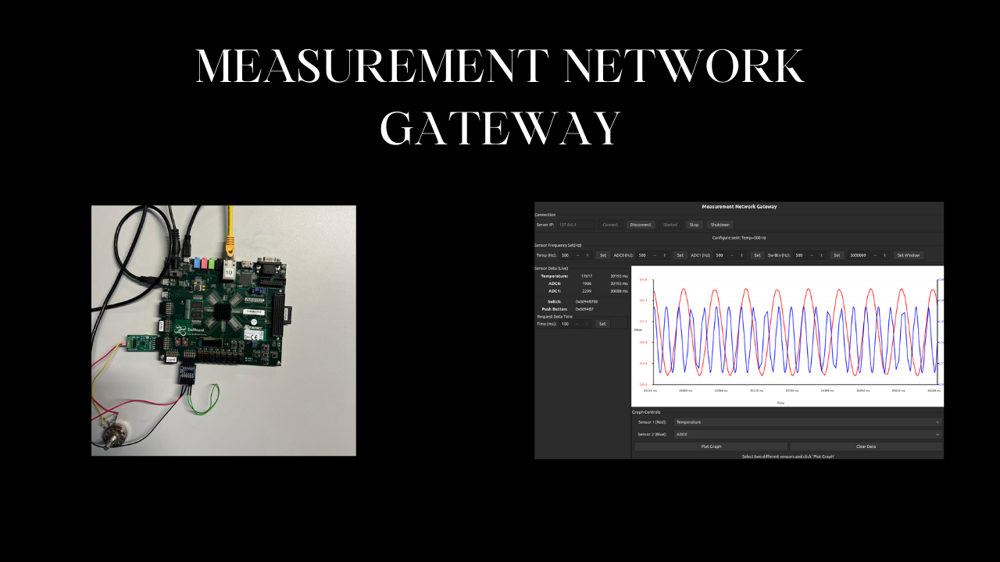
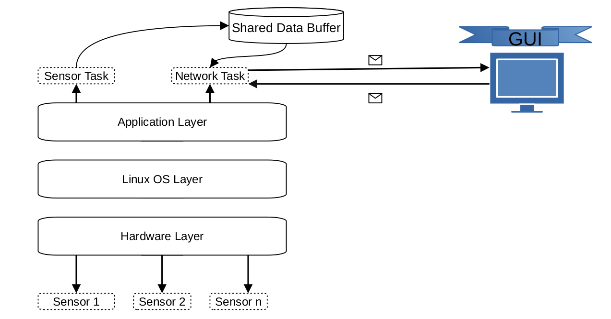
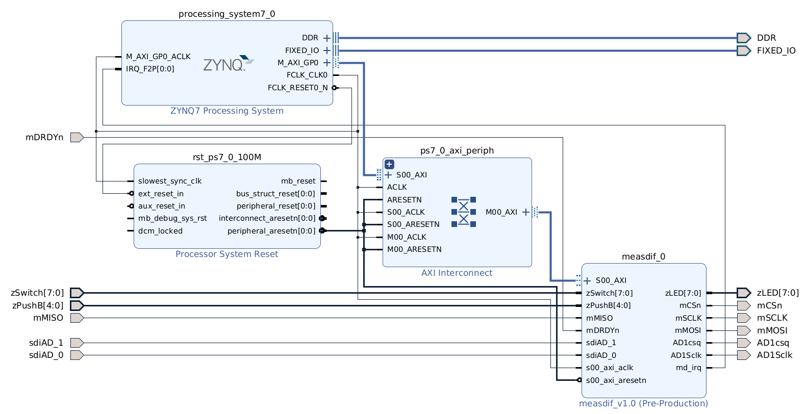
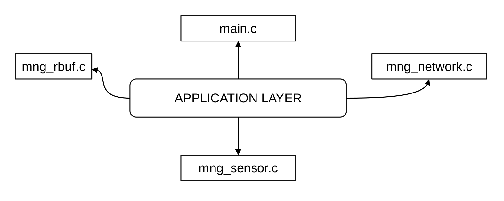

# MNG: Measurement Network Gateway

The **Measurement Network Gateway (MNG)** is a reliable networking solution designed for the synchronized gathering of data from multiple sensor nodes. It serves as a central hub, processing and forwarding aggregated sensor data to a Graphical User Interface (GUI) or a remote client for real-time monitoring and analysis.

## Objective
There may be systems that require **more than 20 sensor nodes**, and it is critical to **monitor and manage these nodes in a reliable and efficient manner**.  

Since **programmable logic (FPGA)** provides **reconfigurable I/O pins**, it enables efficient data acquisition from **multiple sensor nodes** through the **Programmable Logic (PL)** with **very low latency**. This approach allows parallel data handling and improves system performance.

As the system requires **networking capabilities** and **reliable hardware access**, **PetaLinux** is used to create a **custom Embedded Linux image** running on the **ZedBoard**. This allows seamless integration of hardware and software while supporting scalable, flexible, and reliable system operation.

## System Architecture

### Hardware Block Design
The hardware platform is implemented on the **ZedBoard (Zynq-7000 SoC)** using **Vivado**.  
The block design consists of the **Processing System (PS)**, **Programmable Logic (PL)** connected via **AXI interconnects** and our custom IP **measdif_v1.0** for communicate with sensors .

### Application Layer
The application layer is shown in the following figure.  
For more details, please refer to the [Software Development Report](docs/software-development-report.md).

## Demo Link

Please visit the following link to watch the full project demo video:  
[Project Demo Video](https://your-link-here)
